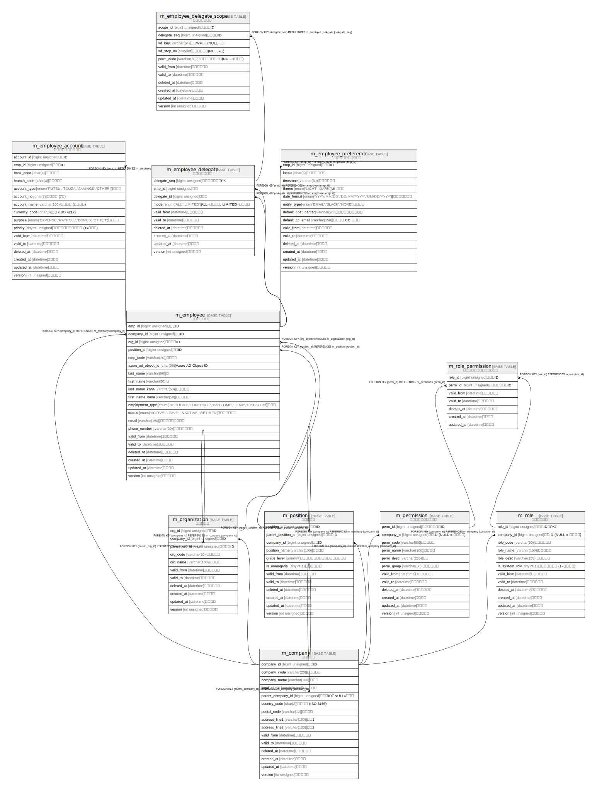

# sample_rdb

## テーブル一覧

| #  | 名前                                                        | カラム一覧      | コメント                       | タイプ        |
| -- | --------------------------------------------------------- | ---------- | -------------------------- | ---------- |
| 1  | [m_company](m_company.md)                                 | 15         | 会社マスタ                      | BASE TABLE |
| 2  | [m_employee](m_employee.md)                               | 20         | 従業員マスタ                     | BASE TABLE |
| 3  | [m_employee_account](m_employee_account.md)               | 16         | 従業員振込口座マスタ                 | BASE TABLE |
| 4  | [m_employee_delegate](m_employee_delegate.md)             | 10         | 代理設定マスタ                    | BASE TABLE |
| 5  | [m_employee_delegate_scope](m_employee_delegate_scope.md) | 11         | 代理範囲マスタ                    | BASE TABLE |
| 6  | [m_employee_preference](m_employee_preference.md)         | 14         | 従業員個人設定マスタ                 | BASE TABLE |
| 7  | [m_organization](m_organization.md)                       | 11         | 組織マスタ                      | BASE TABLE |
| 8  | [m_permission](m_permission.md)                           | 12         | パーミッションマスタ                 | BASE TABLE |
| 9  | [m_position](m_position.md)                               | 12         | 役職マスタ                      | BASE TABLE |
| 10 | [m_role](m_role.md)                                       | 12         | ロールマスタ                     | BASE TABLE |
| 11 | [m_role_permission](m_role_permission.md)                 | 7          | ロールパーミッションマスタ              | BASE TABLE |

## ER図

---

> Generated by [tbls](https://github.com/k1LoW/tbls)
