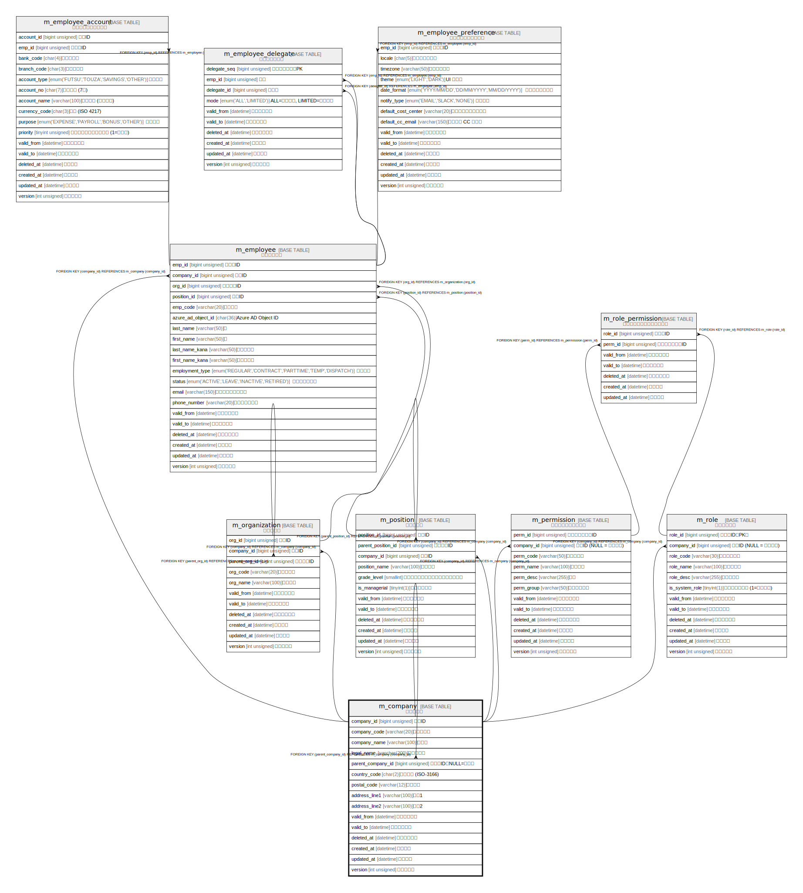

# m_company

## 概要

会社マスタ

<details>
<summary><strong>テーブル定義</strong></summary>

```sql
CREATE TABLE `m_company` (
  `company_id` bigint unsigned NOT NULL AUTO_INCREMENT COMMENT '会社ID',
  `company_code` varchar(20) COLLATE utf8mb4_ja_0900_as_cs_ks NOT NULL COMMENT '会社コード',
  `company_name` varchar(100) COLLATE utf8mb4_ja_0900_as_cs_ks NOT NULL COMMENT '会社名',
  `legal_name` varchar(200) COLLATE utf8mb4_ja_0900_as_cs_ks DEFAULT NULL COMMENT '登記上名称',
  `parent_company_id` bigint unsigned DEFAULT NULL COMMENT '親会社ID（NULL=持株）',
  `country_code` char(2) COLLATE utf8mb4_ja_0900_as_cs_ks NOT NULL DEFAULT 'JP' COMMENT '国コード (ISO-3166)',
  `postal_code` varchar(12) COLLATE utf8mb4_ja_0900_as_cs_ks NOT NULL COMMENT '郵便番号',
  `address_line1` varchar(100) COLLATE utf8mb4_ja_0900_as_cs_ks NOT NULL COMMENT '住所1',
  `address_line2` varchar(100) COLLATE utf8mb4_ja_0900_as_cs_ks DEFAULT NULL COMMENT '住所2',
  `valid_from` datetime NOT NULL DEFAULT CURRENT_TIMESTAMP COMMENT '有効開始日時',
  `valid_to` datetime NOT NULL DEFAULT '9999-12-31 23:59:59' COMMENT '有効終了日時',
  `deleted_at` datetime DEFAULT NULL COMMENT '論理削除日時',
  `created_at` datetime NOT NULL DEFAULT CURRENT_TIMESTAMP COMMENT '登録日時',
  `updated_at` datetime NOT NULL DEFAULT CURRENT_TIMESTAMP ON UPDATE CURRENT_TIMESTAMP COMMENT '更新日時',
  `version` int unsigned NOT NULL DEFAULT '1' COMMENT 'バージョン',
  PRIMARY KEY (`company_id`),
  UNIQUE KEY `company_code` (`company_code`,`deleted_at`),
  KEY `parent_company_id` (`parent_company_id`),
  CONSTRAINT `m_company_ibfk_1` FOREIGN KEY (`parent_company_id`) REFERENCES `m_company` (`company_id`)
) ENGINE=InnoDB AUTO_INCREMENT=[Redacted by tbls] DEFAULT CHARSET=utf8mb4 COLLATE=utf8mb4_ja_0900_as_cs_ks COMMENT='会社マスタ'
```

</details>

## カラム一覧

| #  | 名前                | タイプ             | デフォルト値              | Nullable | Extra Definition                              | 子テーブル                                                                                                                                                                     | 親テーブル                     | コメント                  |
| -- | ----------------- | --------------- | ------------------- | -------- | --------------------------------------------- | ------------------------------------------------------------------------------------------------------------------------------------------------------------------------- | ------------------------- | --------------------- |
| 1  | company_id        | bigint unsigned |                     | false    | auto_increment                                | [m_company](m_company.md) [m_employee](m_employee.md) [m_organization](m_organization.md) [m_permission](m_permission.md) [m_position](m_position.md) [m_role](m_role.md) |                           | 会社ID                  |
| 2  | company_code      | varchar(20)     |                     | false    |                                               |                                                                                                                                                                           |                           | 会社コード                 |
| 3  | company_name      | varchar(100)    |                     | false    |                                               |                                                                                                                                                                           |                           | 会社名                   |
| 4  | legal_name        | varchar(200)    |                     | true     |                                               |                                                                                                                                                                           |                           | 登記上名称                 |
| 5  | parent_company_id | bigint unsigned |                     | true     |                                               |                                                                                                                                                                           | [m_company](m_company.md) | 親会社ID（NULL=持株）        |
| 6  | country_code      | char(2)         | JP                  | false    |                                               |                                                                                                                                                                           |                           | 国コード (ISO-3166)       |
| 7  | postal_code       | varchar(12)     |                     | false    |                                               |                                                                                                                                                                           |                           | 郵便番号                  |
| 8  | address_line1     | varchar(100)    |                     | false    |                                               |                                                                                                                                                                           |                           | 住所1                   |
| 9  | address_line2     | varchar(100)    |                     | true     |                                               |                                                                                                                                                                           |                           | 住所2                   |
| 10 | valid_from        | datetime        | CURRENT_TIMESTAMP   | false    | DEFAULT_GENERATED                             |                                                                                                                                                                           |                           | 有効開始日時                |
| 11 | valid_to          | datetime        | 9999-12-31 23:59:59 | false    |                                               |                                                                                                                                                                           |                           | 有効終了日時                |
| 12 | deleted_at        | datetime        |                     | true     |                                               |                                                                                                                                                                           |                           | 論理削除日時                |
| 13 | created_at        | datetime        | CURRENT_TIMESTAMP   | false    | DEFAULT_GENERATED                             |                                                                                                                                                                           |                           | 登録日時                  |
| 14 | updated_at        | datetime        | CURRENT_TIMESTAMP   | false    | DEFAULT_GENERATED on update CURRENT_TIMESTAMP |                                                                                                                                                                           |                           | 更新日時                  |
| 15 | version           | int unsigned    | 1                   | false    |                                               |                                                                                                                                                                           |                           | バージョン                 |

## 制約一覧

| # | 名前               | タイプ         | 定義                                                                |
| - | ---------------- | ----------- | ----------------------------------------------------------------- |
| 1 | company_code     | UNIQUE      | UNIQUE KEY company_code (company_code, deleted_at)                |
| 2 | m_company_ibfk_1 | FOREIGN KEY | FOREIGN KEY (parent_company_id) REFERENCES m_company (company_id) |
| 3 | PRIMARY          | PRIMARY KEY | PRIMARY KEY (company_id)                                          |

## INDEX一覧

| # | 名前                | 定義                                                             |
| - | ----------------- | -------------------------------------------------------------- |
| 1 | parent_company_id | KEY parent_company_id (parent_company_id) USING BTREE          |
| 2 | PRIMARY           | PRIMARY KEY (company_id) USING BTREE                           |
| 3 | company_code      | UNIQUE KEY company_code (company_code, deleted_at) USING BTREE |

## ER図



---

> Generated by [tbls](https://github.com/k1LoW/tbls)
