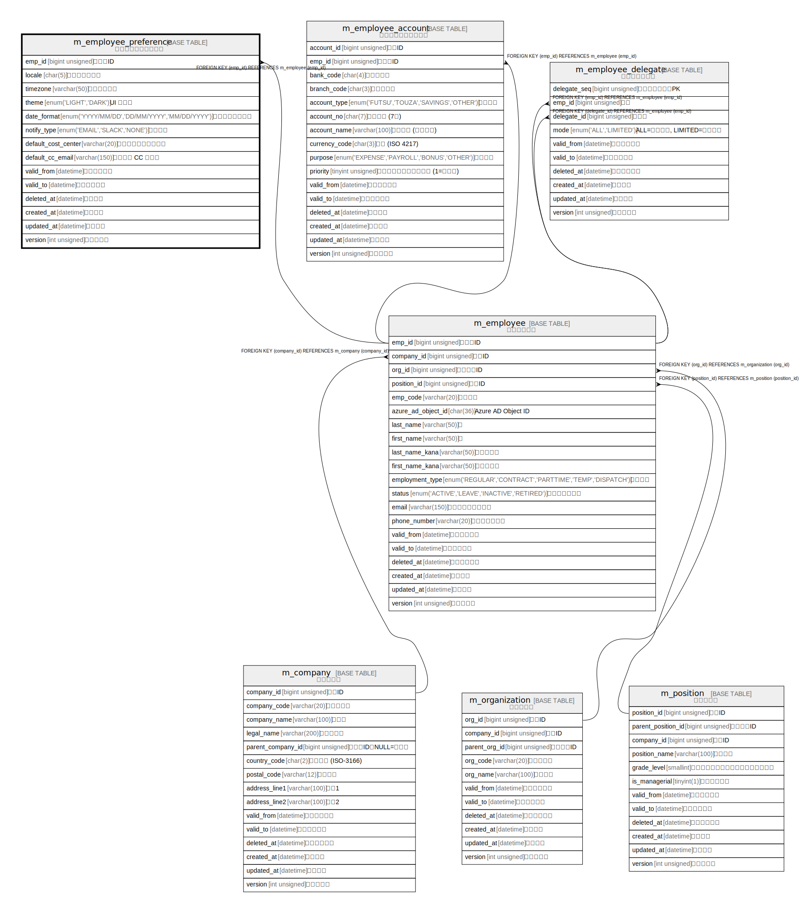

# m_employee_preference

## 概要

従業員個人設定マスタ

<details>
<summary><strong>テーブル定義</strong></summary>

```sql
CREATE TABLE `m_employee_preference` (
  `emp_id` bigint unsigned NOT NULL COMMENT '従業員ID',
  `locale` char(5) COLLATE utf8mb4_ja_0900_as_cs_ks NOT NULL DEFAULT 'ja-JP' COMMENT '言語・ロケール',
  `timezone` varchar(50) COLLATE utf8mb4_ja_0900_as_cs_ks NOT NULL DEFAULT 'Asia/Tokyo' COMMENT 'タイムゾーン',
  `theme` enum('LIGHT','DARK') COLLATE utf8mb4_ja_0900_as_cs_ks NOT NULL DEFAULT 'LIGHT' COMMENT 'UI テーマ',
  `date_format` enum('YYYY/MM/DD','DD/MM/YYYY','MM/DD/YYYY') COLLATE utf8mb4_ja_0900_as_cs_ks NOT NULL DEFAULT 'YYYY/MM/DD' COMMENT '日付フォーマット',
  `notify_type` enum('EMAIL','SLACK','NONE') COLLATE utf8mb4_ja_0900_as_cs_ks NOT NULL DEFAULT 'EMAIL' COMMENT '通知方法',
  `default_cost_center` varchar(20) COLLATE utf8mb4_ja_0900_as_cs_ks DEFAULT NULL COMMENT 'デフォルト原価センタ',
  `default_cc_email` varchar(150) COLLATE utf8mb4_ja_0900_as_cs_ks DEFAULT NULL COMMENT '申請時の CC メール',
  `valid_from` datetime NOT NULL DEFAULT CURRENT_TIMESTAMP COMMENT '有効開始日時',
  `valid_to` datetime NOT NULL DEFAULT '9999-12-31 23:59:59' COMMENT '有効終了日時',
  `deleted_at` datetime DEFAULT NULL COMMENT '論理削除',
  `created_at` datetime NOT NULL DEFAULT CURRENT_TIMESTAMP COMMENT '登録日時',
  `updated_at` datetime NOT NULL DEFAULT CURRENT_TIMESTAMP ON UPDATE CURRENT_TIMESTAMP COMMENT '更新日時',
  `version` int unsigned NOT NULL DEFAULT '1' COMMENT 'バージョン',
  PRIMARY KEY (`emp_id`),
  KEY `locale` (`locale`),
  CONSTRAINT `m_employee_preference_ibfk_1` FOREIGN KEY (`emp_id`) REFERENCES `m_employee` (`emp_id`)
) ENGINE=InnoDB DEFAULT CHARSET=utf8mb4 COLLATE=utf8mb4_ja_0900_as_cs_ks COMMENT='従業員個人設定マスタ'
```

</details>

## カラム一覧

| #  | 名前                  | タイプ                                          | デフォルト値              | Nullable | Extra Definition                              | 子テーブル      | 親テーブル                       | コメント                 |
| -- | ------------------- | -------------------------------------------- | ------------------- | -------- | --------------------------------------------- | ---------- | --------------------------- | -------------------- |
| 1  | emp_id              | bigint unsigned                              |                     | false    |                                               |            | [m_employee](m_employee.md) | 従業員ID                |
| 2  | locale              | char(5)                                      | ja-JP               | false    |                                               |            |                             | 言語・ロケール              |
| 3  | timezone            | varchar(50)                                  | Asia/Tokyo          | false    |                                               |            |                             | タイムゾーン               |
| 4  | theme               | enum('LIGHT','DARK')                         | LIGHT               | false    |                                               |            |                             | UI テーマ               |
| 5  | date_format         | enum('YYYY/MM/DD','DD/MM/YYYY','MM/DD/YYYY') | YYYY/MM/DD          | false    |                                               |            |                             | 日付フォーマット             |
| 6  | notify_type         | enum('EMAIL','SLACK','NONE')                 | EMAIL               | false    |                                               |            |                             | 通知方法                 |
| 7  | default_cost_center | varchar(20)                                  |                     | true     |                                               |            |                             | デフォルト原価センタ           |
| 8  | default_cc_email    | varchar(150)                                 |                     | true     |                                               |            |                             | 申請時の CC メール          |
| 9  | valid_from          | datetime                                     | CURRENT_TIMESTAMP   | false    | DEFAULT_GENERATED                             |            |                             | 有効開始日時               |
| 10 | valid_to            | datetime                                     | 9999-12-31 23:59:59 | false    |                                               |            |                             | 有効終了日時               |
| 11 | deleted_at          | datetime                                     |                     | true     |                                               |            |                             | 論理削除                 |
| 12 | created_at          | datetime                                     | CURRENT_TIMESTAMP   | false    | DEFAULT_GENERATED                             |            |                             | 登録日時                 |
| 13 | updated_at          | datetime                                     | CURRENT_TIMESTAMP   | false    | DEFAULT_GENERATED on update CURRENT_TIMESTAMP |            |                             | 更新日時                 |
| 14 | version             | int unsigned                                 | 1                   | false    |                                               |            |                             | バージョン                |

## 制約一覧

| # | 名前                           | タイプ         | 定義                                                  |
| - | ---------------------------- | ----------- | --------------------------------------------------- |
| 1 | m_employee_preference_ibfk_1 | FOREIGN KEY | FOREIGN KEY (emp_id) REFERENCES m_employee (emp_id) |
| 2 | PRIMARY                      | PRIMARY KEY | PRIMARY KEY (emp_id)                                |

## INDEX一覧

| # | 名前      | 定義                               |
| - | ------- | -------------------------------- |
| 1 | locale  | KEY locale (locale) USING BTREE  |
| 2 | PRIMARY | PRIMARY KEY (emp_id) USING BTREE |

## ER図



---

> Generated by [tbls](https://github.com/k1LoW/tbls)
