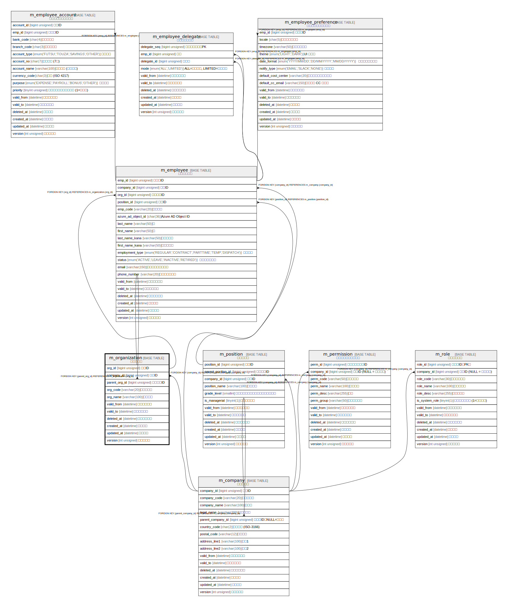

# m_organization

## 概要

組織マスタ

<details>
<summary><strong>テーブル定義</strong></summary>

```sql
CREATE TABLE `m_organization` (
  `org_id` bigint unsigned NOT NULL AUTO_INCREMENT COMMENT '組織ID',
  `company_id` bigint unsigned NOT NULL COMMENT '会社ID',
  `parent_org_id` bigint unsigned DEFAULT NULL COMMENT '上位組織ID',
  `org_code` varchar(20) COLLATE utf8mb4_ja_0900_as_cs_ks NOT NULL COMMENT '組織コード',
  `org_name` varchar(100) COLLATE utf8mb4_ja_0900_as_cs_ks NOT NULL COMMENT '組織名称',
  `valid_from` datetime NOT NULL DEFAULT CURRENT_TIMESTAMP COMMENT '有効開始日時',
  `valid_to` datetime NOT NULL DEFAULT '9999-12-31 23:59:59' COMMENT '有効終了日時',
  `deleted_at` datetime DEFAULT NULL COMMENT '論理削除日時',
  `created_at` datetime NOT NULL DEFAULT CURRENT_TIMESTAMP COMMENT '登録日時',
  `updated_at` datetime NOT NULL DEFAULT CURRENT_TIMESTAMP ON UPDATE CURRENT_TIMESTAMP COMMENT '更新日時',
  `version` int unsigned NOT NULL DEFAULT '1' COMMENT 'バージョン',
  PRIMARY KEY (`org_id`),
  KEY `company_id` (`company_id`),
  KEY `parent_org_id` (`parent_org_id`),
  CONSTRAINT `m_organization_ibfk_1` FOREIGN KEY (`company_id`) REFERENCES `m_company` (`company_id`),
  CONSTRAINT `m_organization_ibfk_2` FOREIGN KEY (`parent_org_id`) REFERENCES `m_organization` (`org_id`)
) ENGINE=InnoDB AUTO_INCREMENT=[Redacted by tbls] DEFAULT CHARSET=utf8mb4 COLLATE=utf8mb4_ja_0900_as_cs_ks COMMENT='組織マスタ'
```

</details>

## カラム一覧

| #  | 名前            | タイプ             | デフォルト値              | Nullable | Extra Definition                              | 子テーブル                                                           | 親テーブル                               | コメント         |
| -- | ------------- | --------------- | ------------------- | -------- | --------------------------------------------- | --------------------------------------------------------------- | ----------------------------------- | ------------ |
| 1  | org_id        | bigint unsigned |                     | false    | auto_increment                                | [m_employee](m_employee.md) [m_organization](m_organization.md) |                                     | 組織ID         |
| 2  | company_id    | bigint unsigned |                     | false    |                                               |                                                                 | [m_company](m_company.md)           | 会社ID         |
| 3  | parent_org_id | bigint unsigned |                     | true     |                                               |                                                                 | [m_organization](m_organization.md) | 上位組織ID       |
| 4  | org_code      | varchar(20)     |                     | false    |                                               |                                                                 |                                     | 組織コード        |
| 5  | org_name      | varchar(100)    |                     | false    |                                               |                                                                 |                                     | 組織名称         |
| 6  | valid_from    | datetime        | CURRENT_TIMESTAMP   | false    | DEFAULT_GENERATED                             |                                                                 |                                     | 有効開始日時       |
| 7  | valid_to      | datetime        | 9999-12-31 23:59:59 | false    |                                               |                                                                 |                                     | 有効終了日時       |
| 8  | deleted_at    | datetime        |                     | true     |                                               |                                                                 |                                     | 論理削除日時       |
| 9  | created_at    | datetime        | CURRENT_TIMESTAMP   | false    | DEFAULT_GENERATED                             |                                                                 |                                     | 登録日時         |
| 10 | updated_at    | datetime        | CURRENT_TIMESTAMP   | false    | DEFAULT_GENERATED on update CURRENT_TIMESTAMP |                                                                 |                                     | 更新日時         |
| 11 | version       | int unsigned    | 1                   | false    |                                               |                                                                 |                                     | バージョン        |

## 制約一覧

| # | 名前                    | タイプ         | 定義                                                             |
| - | --------------------- | ----------- | -------------------------------------------------------------- |
| 1 | m_organization_ibfk_1 | FOREIGN KEY | FOREIGN KEY (company_id) REFERENCES m_company (company_id)     |
| 2 | m_organization_ibfk_2 | FOREIGN KEY | FOREIGN KEY (parent_org_id) REFERENCES m_organization (org_id) |
| 3 | PRIMARY               | PRIMARY KEY | PRIMARY KEY (org_id)                                           |

## INDEX一覧

| # | 名前            | 定義                                            |
| - | ------------- | --------------------------------------------- |
| 1 | company_id    | KEY company_id (company_id) USING BTREE       |
| 2 | parent_org_id | KEY parent_org_id (parent_org_id) USING BTREE |
| 3 | PRIMARY       | PRIMARY KEY (org_id) USING BTREE              |

## ER図



---

> Generated by [tbls](https://github.com/k1LoW/tbls)
